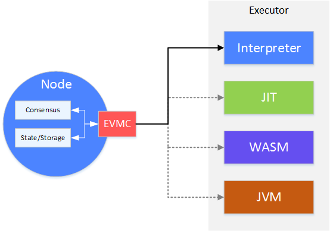

# Execution engine

The execution of transactions is a vital function on blockchain nodes. Transaction execution involves extracting the smart contract binary code from the transaction and executing it using an executor. The consensus module retrieves transactions from the transaction pool, packages them into blocks, and invokes the executor to run the transactions within the blocks. During the execution of transactions, the state of the blockchain is modified, and the new state of the block is stored (referred to as storage). In this process, the executor acts like a black box, with the input being the smart contract code and the output being changes in state.

With technological advancements, attention has turned to the performance and usability of executors. On one hand, there is a desire for smart contracts to execute more quickly on the blockchain to meet the demands of a large volume of transactions. On the other hand, there is a wish to develop using more familiar and user-friendly languages. This has led to the emergence of alternatives to the traditional executor Ethereum Virtual Machine (EVM), such as WASM. The traditional EVM is integrated within the node's code. The first step is to abstract the interface of the executor to be compatible with various virtual machine implementations. Hence, EVMC was designed.

EVMC (Ethereum Client-VM Connector API) is the executor interface abstracted by Ethereum, aimed at interfacing with various types of executors. POTOS currently adopts mainstream smart contract language of Web3.0, Solidity, and therefore continues to use EVMC abstraction of the executor interface."



Within the node, the consensus module hands over the packaged blocks to the executor for execution. When the virtual machine operates, any read and write operations on the state are managed through EVMC callbacks, which in turn manipulate the state data on the node.

Thanks to the abstraction layer of EVMC, POTOS is capable of interfacing with more efficient and user-friendly executors that may emerge in the future. At present, POTOS utilizes evmone to execute Solidity contracts and wasmtime to execute WASM contracts.

```{toctree}
:caption: Execution engine
:maxdepth: 1

evm
precompiled
```
